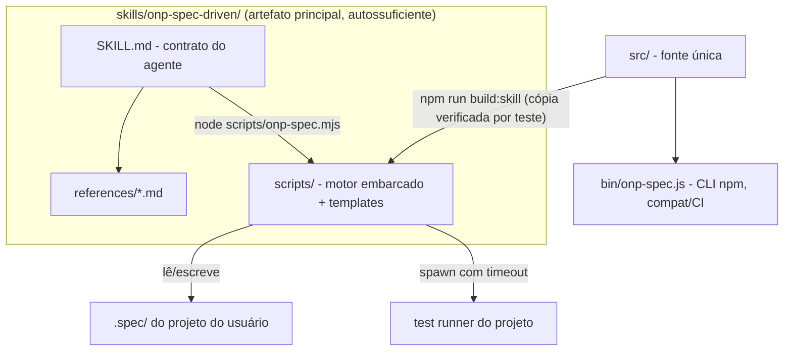

# TDD — onp-spec-driven como skill pura do harness Claude Code

| Campo         | Valor                                                        |
| ------------- | ------------------------------------------------------------ |
| Tech Lead     | @vitormanoel                                                 |
| Time          | Vitor Manoel (O Novo Programador)                            |
| Épico         | Refatoração skill-first (pós-teste exaustivo de 17/07/2026)  |
| Status        | Approved (auto-aprovado — projeto solo)                      |
| Criado        | 2026-07-17                                                   |
| Atualizado    | 2026-07-17                                                   |

## Contexto

A onp-spec-driven é a ferramenta de SDD *spec-anchored* do ONP: a spec é auditada
mecanicamente contra o código (rastreabilidade US→AC→T→teste, DoD executável,
constituição verificável). Hoje ela é entregue como **CLI npm**
(`@onovoprogramador/onp-spec`) + uma skill fina (`skills/onp-spec-driven/`) que
apenas dirige o agente a chamar a CLI via `npx`.

Uma bateria de ~80 cenários adversariais (17/07/2026, ver
`docs/ACHADOS-teste-exaustivo.md`) mostrou que (a) o motor mecânico é sólido no
núcleo — 41/41 testes próprios, benchmark 100% (9/9), escala 600 ACs em 52ms —
mas (b) tem 5 furos críticos que permitem **bypass do gate ou veredito falso**, e
(c) a skill, como está, é **letra morta sem a CLI instalada**: em sandbox,
offline, ou num projeto que nunca rodou `npm i`, o agente não tem como executar o
contrato. A decisão de produto é: **a skill deixa de depender de CLI instalada e
passa a ser o artefato principal**, autossuficiente dentro de `.claude/skills/`.

**Domínio**: tooling de desenvolvimento assistido por IA (material do workshop
Spec-Driven do ONP).
**Stakeholders**: Vitor (autor/instrutor), alunos do workshop (usuários da skill
nos próprios projetos), agentes (Claude Code/Cursor) que executam o fluxo.

## Definição do Problema

### Problemas que estamos resolvendo

- **P1 — Skill inerte sem CLI**: a SKILL.md instrui `onp-spec ...` / `npx ...`.
  Sem o pacote instalado (sandbox, offline, projeto novo), o agente improvisa ou
  ignora o gate. Impacto: o diferencial ("a máquina prova") desliga em silêncio.
- **P2 — Bypass do gate (críticos CR-1..CR-5 dos achados)**:
  - teste `skip`/`todo` conta como prova PASS (`# SKIP` é `ok` no TAP);
  - `[concluída]` com acento vira `pendente` silenciosamente;
  - `audit --json` trunca saída >8KB (`process.exit` antes do flush) — CI cego;
  - regex patológica na constituição trava o audit (ReDoS, 60s+);
  - preset base exige teste `@principle:P-001` que o fluxo nunca cria → o gate
    **nunca** fecha no caminho feliz e o usuário aprende a ignorá-lo.
- **P3 — Falsos positivos que corroem confiança (AL-1..AL-7)**: NFD do macOS
  quebra "Então"; caminho com espaço explode em `ARQUIVO_INEXISTENTE`; GWT
  indentado vira `AC_INCOMPLETO`; glob com typo desliga princípio sem aviso;
  nível `[OBRIGATORIO]` some; seções Suposições/Perguntas ausentes passam
  batido (o diferencial #3 não é imposto).
- **P4 — Skill sem contrato operacional para o agente**: sem loop de correção
  limitado, sem commits atômicos por task, sem estratégia de contexto, sem
  degradação graciosa quando `node` não existe.

### Por que agora?

- A skill é material central do workshop (Edição em andamento) — alunos vão
  copiá-la para projetos reais já em agosto/2026.
- O benchmark público afirma "o agente não consegue declarar vitória"; CR-1
  (skip = prova) falsifica a afirmação hoje.

### Impacto de não resolver

- **Negócio**: a demo do workshop quebra no primeiro `audit --ci` (CR-5) e a
  tese de venda ("100% de detecção") fica vulnerável a contra-exemplo trivial.
- **Técnico**: cada projeto que instala a skill via `init --agents` congela uma
  cópia com os bugs (drift SK-5).
- **Usuários**: falsos `AC_INCOMPLETO` em specs corretas (NFD) ensinam a
  desconfiar do audit — o oposto do produto.

## Escopo

### ✅ Dentro do escopo (V1)

- Skill autossuficiente em `skills/onp-spec-driven/`: SKILL.md reescrita
  (harness-first), referências, **motor mecânico embarcado** em `scripts/`
  (zero dependências, roda com o `node` do ambiente — sem npm/npx/instalação).
- Correção dos 5 críticos (CR-1..CR-5) e dos 7 altos (AL-1..AL-7) no motor
  (`src/`), que continua sendo a fonte única de verdade.
- Sincronização gerada `src/ → skills/onp-spec-driven/scripts/` com teste que
  falha se divergirem (mata SK-5).
- Contrato operacional do agente na SKILL.md: loop de correção limitado (3
  iterações), commit atômico por task, gate final com saída colada, degradação
  graciosa sem `node`.
- Novos achados: `GLOB_SEM_ARQUIVOS`, `NIVEL_INVALIDO`, `SECAO_AUSENTE`,
  `FEATURE_DIVERGENTE`, `PROVA_FRACA`, `ID_CURTO`, `TASK_STATUS_INVALIDO`.
- Semântica de refs global (IDs são globais → refs cruzadas entre features
  resolvem, MD-1).
- Testes de regressão para todos os achados corrigidos (a bateria adversarial
  vira suíte).

### ❌ Fora do escopo (V1)

- Remover/despublicar a CLI npm (continua existindo para CI puro; vira consumidora
  do mesmo `src/`).
- Suporte a Windows nativo (caminhos `\`) além do que já existe.
- Novos reporters de teste (mantém tap, vitest-json, jest-json, exitcode).
- Tradução da skill para inglês.
- Lessons/memória auto-evolutiva estilo TLC (fica para V2).

### 🔮 Futuro (V2+)

- `verificação(auditoria)` com queries semânticas; watch mode; lessons layer;
  instalador `--agents cursor`.

## Solução Técnica

### Visão da arquitetura

Inversão de dependência: hoje `skill → CLI global`; passa a ser
`skill ⊃ motor` (o motor viaja dentro da skill) e `CLI → mesmo motor` (compat).

**Componentes**:

- `SKILL.md` — o contrato do agente: fases, auto-dimensionamento, gate,
  degradação. Nunca menciona npm/npx; resolve `scripts/` relativo ao diretório
  da própria skill.
- `scripts/onp-spec.mjs` + `scripts/lib/` + `scripts/templates/` — cópia gerada
  de `src/` + `templates/` (motor embarcado). Zero dependências; requisito
  único: Node ≥ 18 presente no ambiente (já requisito de projetos JS; para
  projetos não-JS o audit estrutural continua funcionando — só o `verify`
  depende do runner da stack).
- `src/` — fonte única; recebe todas as correções.
- `tools/build-skill.mjs` — gera `scripts/` a partir de `src/`+`templates/`;
  `test/skill-sync.test.js` falha se `scripts/` divergir do gerado.

### Decisão central: motor mecânico embarcado (não "agente audita na mão")

A alternativa "o agente faz o audit lendo os arquivos" foi **rejeitada**: o
produto existe exatamente porque autor não pode ser verificador. A prova precisa
vir de um processo determinístico fora do modelo (exit code), senão regredimos a
"confie na palavra do agente". O motor embarcado preserva isso sem pedir
instalação: copiar a pasta da skill é a instalação inteira.

### Correções no motor (contratos, por achado)

| Achado | Correção (contrato observável) |
|---|---|
| CR-1 | Parser TAP/JSON reconhece `# SKIP`/`# TODO`/`skipped`/`todo`/`pending` → veredito `skip`. `skip` **nunca** vira prova PASS; audit acusa `AC_SEM_PROVA` citando o skip. Regra por tag: qualquer `fail` → fail; senão qualquer `pass` → pass; senão → skip. |
| CR-2 | Status de task normalizado (minúsculas + sem acento): `concluída`/`Concluida` ⇒ `concluida`. Token desconhecido em `[...]` ⇒ `TASK_STATUS_INVALIDO` (erro) — nunca degradar para `pendente` em silêncio. |
| CR-3 | `bin` e entrypoint embarcado usam `process.exitCode` (nunca `process.exit()` após escrever no stdout) → saída completa garantida em pipe/CI. |
| CR-4 | Verificações regex da constituição rodam em subprocesso com timeout (5s por verificação); estouro ⇒ `VERIFICACAO_MALFORMADA` ("regex excedeu o tempo limite") em vez de travar o gate. |
| CR-5 | Preset base: P-001 passa a usar `verificação(gate)` — satisfeita pelo próprio mecanismo do audit (documentada como intrínseca). `scaffold` passa a gerar também esqueleto de teste para toda `verificação(teste)` sem tag existente ⇒ caminho feliz fecha com exit 0 sem passos ocultos. |
| AL-1 | Todo conteúdo lido é normalizado `NFC` antes do parse (specs, tasks, constituição, anotações). |
| AL-2 | `Arquivos:` divide **apenas por vírgula** (espaços em caminhos são válidos); crases continuam removidas. |
| AL-3 | Cláusulas GWT e campos de task aceitam indentação e marcadores `-`/`*`; `**dado**`/`**DADO**` aceitos (match sem case). |
| AL-4 | Glob de `verificação(proibido/obrigatório)` que casa 0 arquivos ⇒ `GLOB_SEM_ARQUIVOS` (aviso). |
| AL-5 | `## P-xxx [NÍVEL]` com nível fora de DEVE/RECOMENDADO/PODE ⇒ `NIVEL_INVALIDO` (erro) — nunca ignorar. |
| AL-6 | Seções `## Suposições` e `## Perguntas em aberto` ausentes ⇒ `SECAO_AUSENTE` (aviso em rascunho; erro com status ≥ `pronta`). "Nenhuma." explícito satisfaz. |
| AL-7/MD-6 | Prova por método `exitcode` só é concedida a AC com teste anotado, e todo proof `exitcode` gera `PROVA_FRACA` (aviso) — bypass por comentário+exitcode fechado. |
| MD-1 | Refs resolvem contra o conjunto **global** de IDs (IDs já são globais); cobertura de AC idem. |
| MD-2 | `> feature:` ≠ nome do diretório ⇒ `FEATURE_DIVERGENTE` (aviso). |
| MD-3 | IDs de 1–2 dígitos em headings ⇒ `ID_CURTO` (aviso, "use 3+ dígitos"). |
| MD-4 | `verify` com 0 tags casadas imprime dica explícita: "nenhum título de teste contém `@spec:AC-xxx` — a tag vai no TÍTULO do teste". |

### Contrato da skill (SKILL.md reescrita)

- **Fluxo**: Especificar → (Projetar) → (Tarefas) → Executar → **Auditar**, com
  auto-dimensionamento e válvula de segurança (se ao listar passos aparecerem
  >5 passos ou dependências, volta e cria `tasks.md`).
- **Gate inegociável**: última ação de qualquer feature = rodar o audit em modo
  CI e **colar a saída**; exit ≠ 0 ⇒ não está pronto.
- **Loop limitado**: no máximo 3 ciclos corrigir→re-auditar; persiste falhando ⇒
  parar e apresentar achados ao usuário (nunca afrouxar teste/princípio).
- **Execução**: 1 task = 1 commit atômico; teste primeiro (scaffold), depois
  implementação até o runner passar.
- **Contexto**: referências carregadas sob demanda por fase; nunca carregar duas
  specs de features diferentes simultaneamente.
- **Degradação graciosa**: sem `node` no ambiente ⇒ a skill instrui checklist
  manual dos mesmos achados, com o resultado marcado explicitamente como
  `PROVA FRACA (auditoria manual)` — nunca silencioso.

### Mudanças de dados/formato

- `.spec/` inalterado (compat total com projetos existentes).
- `verification/<feature>.json`: campo `status` ganha valor `skip`; campo
  `method` já existente passa a ser exigido na leitura (ausente ⇒ tratado como
  fraco).
- Catálogo de achados: + `GLOB_SEM_ARQUIVOS`, `NIVEL_INVALIDO`, `SECAO_AUSENTE`,
  `FEATURE_DIVERGENTE`, `PROVA_FRACA`, `ID_CURTO`, `TASK_STATUS_INVALIDO`
  (documentados em ARQUITETURA.md).

## Riscos

| Risco | Impacto | Prob. | Mitigação |
|---|---|---|---|
| Cópia `scripts/` diverge de `src/` (drift) | Alto | Média | Build gerado + `skill-sync.test.js` que falha a suíte se divergir; regeneração é um comando |
| Aceitar variantes (acento/case/indentação) cria ambiguidade nova | Médio | Média | Normalização documentada na gramática; testes de regressão para cada variante aceita e cada rejeitada |
| Subprocesso com timeout por verificação regex deixa o audit mais lento | Baixo | Alta | Só verificações `proibido`/`obrigatório` pagam o custo (~50ms cada); orçamento medido no teste de escala (600 ACs < 2s) |
| Mudança de semântica de refs (local→global) muda resultado de audits existentes | Médio | Baixa | Só remove erros falsos (REF_QUEBRADA de ref válida); nunca adiciona erro novo; changelog explícito |
| `verificação(gate)` mal compreendida (parece "de graça") | Baixo | Média | Documentação no preset explica que ela é satisfeita pelo mecanismo do audit; LGPD mantém testes reais |
| Projetos não-JS sem `node` perdem o gate mecânico | Médio | Baixa | Degradação graciosa explícita (PROVA FRACA) + audit estrutural continua rodável em qualquer CI com Node |

## Estratégia de Testes

| Tipo | Escopo | Abordagem |
|---|---|---|
| Unit | parsers (TAP skip/todo, status normalizado, NFC, vírgula em Arquivos, níveis) | `node:test`, casos derivados 1:1 dos achados |
| Unit | audit (novos achados, refs globais, seção ausente, prova fraca) | fixtures em memória |
| Integração | CLI/entrypoint embarcado ponta-a-ponta em sandbox (init→new→scaffold→verify→audit exit 0) | processo real, TAP real |
| Regressão adversarial | os ~80 cenários do laboratório viram `test/adversarial.test.js` (os 12 que falhavam DEVEM passar) | sandbox por cenário |
| Sync | `scripts/` ≡ build de `src/` | hash por arquivo |
| Benchmark | 100% (9/9) e baseline limpo preservados | `node benchmark/run.js` |

**Cenários críticos**: skip nunca prova; `[concluída]` fecha o gate correto;
JSON de 600 ACs íntegro via pipe; ReDoS não trava; caminho feliz (init base →
new → scaffold → implementar → verify → audit --ci) sai 0 sem passo oculto.

## Plano de Implementação

| Fase | Task | Saída verificável |
|---|---|---|
| **F1 — Motor** | Corrigir CR-1..CR-4, AL-1..AL-7, MD-1..MD-4 em `src/` + testes de regressão | suíte `node --test` verde incluindo novos casos |
| | Preset base com `verificação(gate)` + scaffold de testes de princípio (CR-5) | caminho feliz fecha com exit 0 |
| **F2 — Empacotamento** | `tools/build-skill.mjs` (src+templates → scripts/) + teste de sync | `skill-sync.test.js` verde |
| **F3 — Skill** | Reescrever SKILL.md (harness-first, sem npx) + referências atualizadas | revisão manual + smoke com agente |
| **F4 — Validação** | Bateria adversarial completa re-executada contra o motor embarcado | 0 achados críticos/altos remanescentes |
| | Benchmark + suíte + E2E do fluxo feliz | tudo verde, saída colada |

Dependências: F2 depende de F1; F4 fecha o ciclo (mesma régua dos achados).

## Dependências

| Dependência | Tipo | Status | Risco |
|---|---|---|---|
| Node ≥ 18 no ambiente do agente | Runtime | Presente no Claude Code | Baixo |
| Test runner do projeto do usuário (verify) | Externa | Varia por stack | Médio — degradação documentada |
| Nenhum pacote npm | — | zero-dep mantido | — |

## Questões em Aberto

| # | Questão | Posição atual | Status |
|---|---|---|---|
| 1 | Renomear a skill instalada para evitar colisão com a TLC `spec-driven` em projetos que têm ambas? | Manter `onp-spec-driven` (nome já distinto) e declarar fronteira no description | ✅ Resolvida |
| 2 | A CLI npm deve ser deprecada na doc? | Não — vira "modo CI"; skill é o caminho principal | ✅ Resolvida |
| 3 | Lessons layer (estilo TLC) nesta versão? | V2 — fora do escopo | ✅ Resolvida |
| 4 | Aceitar IDs de 1–2 dígitos em vez de só avisar? | Só aviso (`ID_CURTO`) — mudar a gramática quebra unicidade visual | ✅ Resolvida |

## Plano de Rollback

- A refatoração é aditiva e versionada em git no repo `onp-spec-driven`; rollback
  = `git revert` do range (sem migração de dados — `.spec/` dos usuários não muda
  de formato).
- A CLI npm publicada permanece funcional durante toda a transição; se a skill
  embarcada apresentar regressão em campo, a SKILL.md antiga (CLI-first) volta
  por revert enquanto o motor é corrigido.
- Gatilho de rollback: qualquer cenário da bateria adversarial crítica (CR-*)
  regredindo, ou benchmark < 100%.
